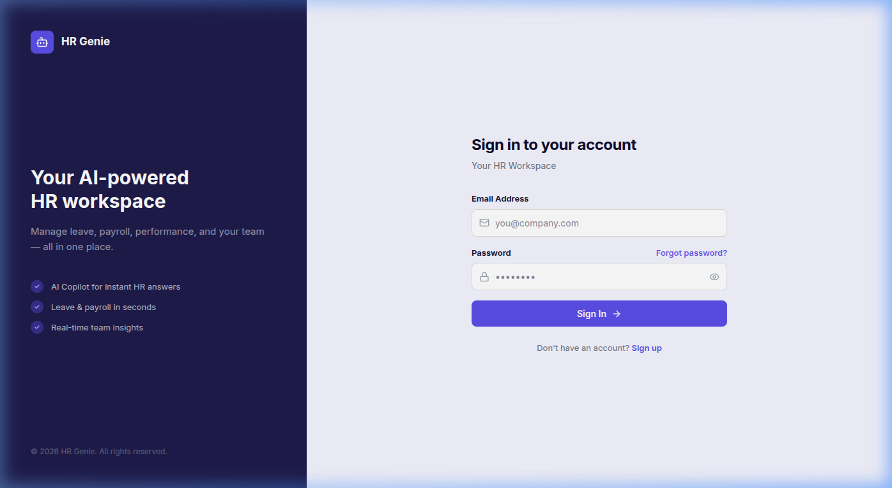
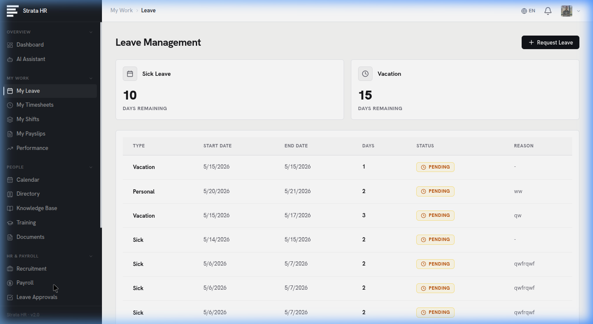

# HR Genie

Welcome to **HR Genie**, your modern, AI-powered Human Resources Management Assistant. Built for modern HR teams, HR Genie simplifies, automates, and enhances all your daily HR operations from recruitment to payroll, backed by intelligent AI support.

---

## Screenshots

### Login Page
A clean, professional entry point to the application.


### Admin Dashboard
The central hub for HR and Admin users, featuring real-time statistics, employee headcount distributions, chat activity insights, and quick actions.


---

## Key Features

*   **AI Assistant**: Get instant answers to HR policy questions and automated help via the integrated OpenAI chat assistant.
*   **Comprehensive Dashboard**: Real-time analytics, headcounts, leave balances, and quick actions at a glance.
*   **Leave Management**: Streamlined requesting and approval workflows for sick leave, vacations, and more.
*   **Knowledge Base**: A centralized repository for all company policies, procedures, and training documents.
*   **Recruitment Tracking**: Manage job postings and track applicant statuses efficiently.
*   **Payroll Management**: Automated base salary, bonus, and tax deduction calculations.
*   **Performance Reviews**: Structured evaluation criteria, ratings, and feedback tracking.
*   **Department Organization**: Easily construct and manage your organizational hierarchy.
*   **User Management**: Role-based access control (Employee, HR, Admin) to ensure data privacy and security.

## Technology Stack

**Frontend:**
*   **Framework**: React (v19) via Vite
*   **Styling**: Tailwind CSS (v4)
*   **Charting**: Recharts
*   **Icons**: Lucide React
*   **Routing**: React Router DOM (v7)

**Backend:**
*   **Environment**: Node.js & Express
*   **Database**: PostgreSQL
*   **Authentication**: JSON Web Tokens (JWT) & bcrypt
*   **AI Integration**: OpenAI API

## Getting Started

Provide instructions on how to set up the project locally.

### Prerequisites
*   Node.js (v18 or higher recommended)
*   PostgreSQL
*   An OpenAI API Key

### Installation

1.  **Clone the repository**
    ```bash
    git clone https://github.com/yourusername/HR-Genie.git
    cd HR-Genie
    ```

2.  **Backend Setup**
    ```bash
    cd backend
    npm install
    # Create a .env file based on the provided .env.example
    # Add your DATABASE_URL, JWT_SECRET, and OPENAI_API_KEY
    
    # Initialize the database schema
    node scripts/init_db.js
    
    # Start the backend development server
    npm run dev
    ```

3.  **Frontend Setup**
    ```bash
    cd frontend/hr-genie-frontend
    npm install
    npm run dev
    ```

4.  **Access the Application**
    Open your browser and navigate to `http://localhost:5173`. You can register a new account to get started.

## License
This project is licensed under the ISC License.
