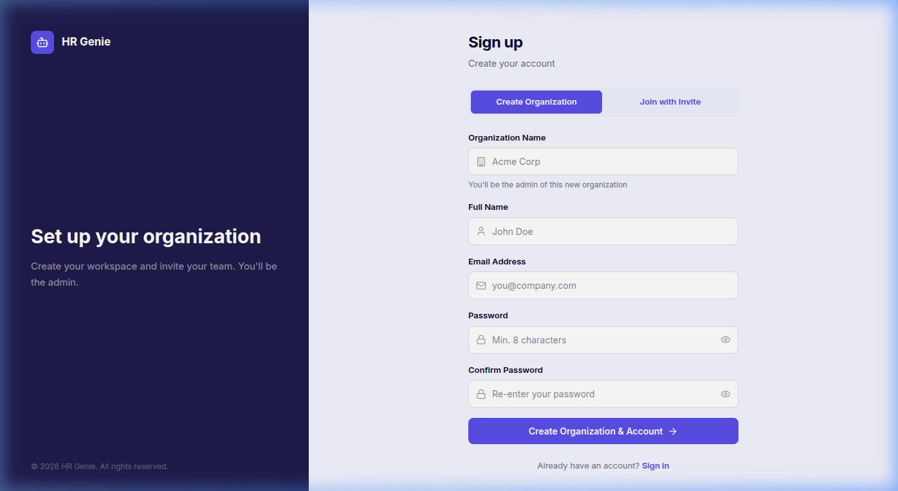
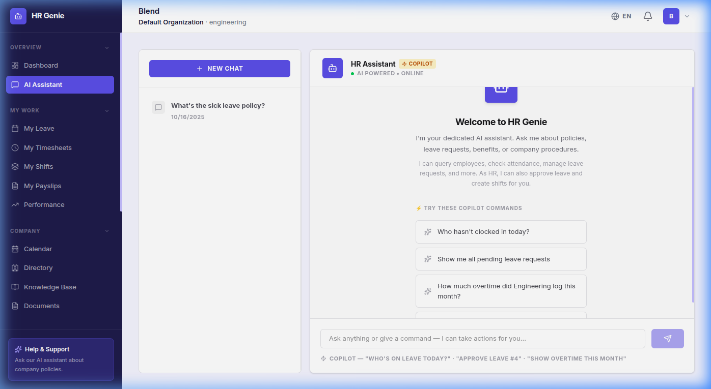
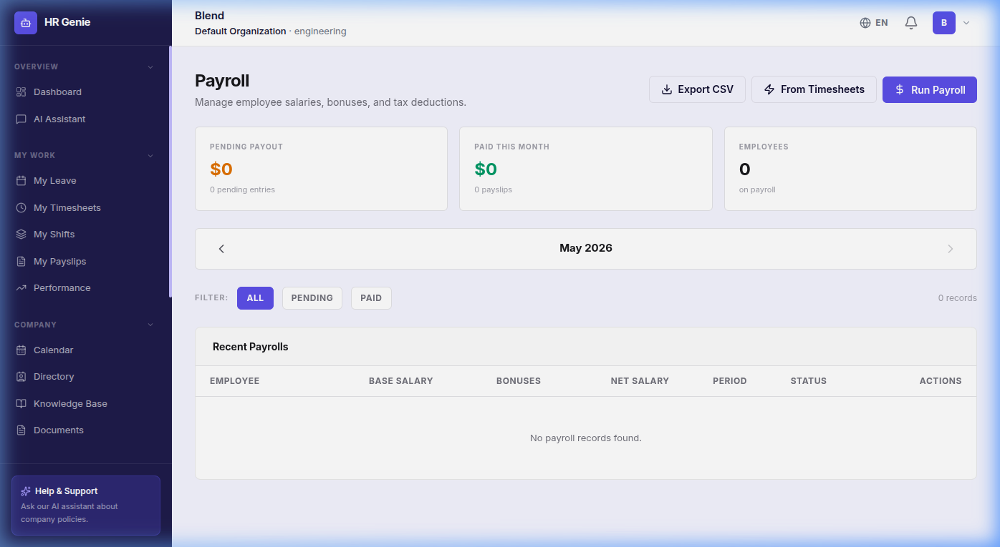
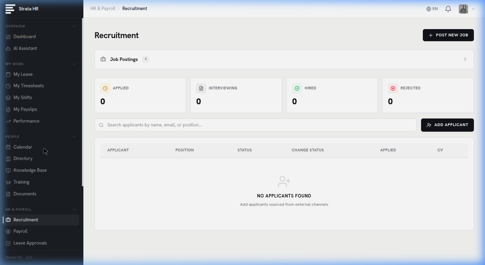

<p align="center">
  
  
  
  
  
  
</p>

<h1 align="center">🤖 HR Genie</h1>
<p align="center">
  <strong>AI-Powered Human Resources Management Platform</strong><br/>
  A full-stack, multi-tenant HR SaaS application with an integrated AI Copilot that can query data, approve leave, manage shifts, and answer HR policy questions — all via natural language.
</p>

---

## 📸 Screenshots

### Authentication
| Login | Register |
|:-----:|:--------:|
|  |  |

### Dashboard


### AI Copilot Chat


### Leave Management


### Payroll


### Recruitment


### Calendar & Events


---

## ✨ Features

### 🤖 AI Copilot
- **Natural-language HR assistant** powered by OpenAI GPT-4o
- Executes real actions: approve leave, query attendance, check overtime, create shifts
- Context-aware — understands your role (Employee / HR / Admin) and responds accordingly
- Conversation history with persistent chat threads

### 👥 Core HR
- **Employee Directory** — searchable, filterable org-wide people directory
- **Department Management** — create, edit, assign managers
- **User Management** — invite via code, role-based access (Employee / HR / Admin)
- **Organization Settings** — company profile, branding, configurations

### 📅 Leave & Attendance
- **Leave Requests** — submit, track status, view remaining balances (sick / vacation)
- **Leave Approvals** — HR/Admin approval workflow with one-click actions
- **Timesheet Tracking** — clock in/out, log hours, view weekly summaries
- **Timesheet Approvals** — manager review and approval pipeline

### 💰 Payroll
- **Payroll Processing** — calculate net salary (base + bonus − tax deductions)
- **Payslip Generation** — detailed, printable payslip modals with PDF export
- **Employee Payslip View** — self-service payslip access for all employees

### 📊 Performance & Goals
- **Performance Reviews** — star-rated evaluations with written feedback
- **AI Draft Generation** — auto-generate review drafts based on employee history
- **Goal Tracking** — set, track, and update personal and team objectives

### 🗓️ Scheduling & Calendar
- **Shift Scheduling** — create and assign shifts with visual calendar view
- **Company Calendar** — shared events, meetings, holidays
- **Event Management** — create events with attendee lists

### 📄 Documents & Knowledge
- **Document Management** — upload, categorize, and share company files (Cloudinary storage)
- **Knowledge Base** — searchable internal wiki for policies, procedures, and FAQs

### 🎯 Recruitment
- **Job Postings** — create and manage open positions
- **Application Tracking** — pipeline view of candidates per job
- **Public Careers Page** — shareable careers page for external applicants

### 📈 Reports & Analytics
- **Dashboard Analytics** — headcount, leave balances, chat activity, open positions
- **HR Reports** — exportable data views across departments
- **Data Export** — CSV export for payroll, attendance, and leave data

### 🌍 Internationalization (i18n)
- **3 Languages**: English (EN), Albanian/Kosovo dialect (SQ), German/formal (DE)
- Real-time language switching from the navbar — no page reload required

### 🔔 Notifications
- In-app notification bell with real-time alerts
- Leave approvals, shift assignments, and system notifications

---

## 🏗️ Architecture

```
HR-Genie/
├── backend/                    # Node.js + Express 5 API
│   ├── config/                 # Database config (PostgreSQL)
│   ├── controllers/            # Route handlers (20+ controllers)
│   ├── middleware/              # Auth (JWT), rate limiting, error handling
│   ├── routes/                 # RESTful API routes
│   ├── utils/                  # Email templates, helpers
│   ├── scripts/                # Utility scripts
│   ├── db-migrate*.js          # Database migrations (modular)
│   └── server.js               # Express entry point
│
├── frontend/hr-genie-frontend/ # React 19 + Vite 7 SPA
│   ├── src/
│   │   ├── components/
│   │   │   ├── auth/           # Login, Register
│   │   │   ├── layouts/        # Sidebar, Navbar, Layout
│   │   │   ├── modals/         # Department, Payroll, Job, Event, Evaluation, Payslip
│   │   │   ├── chat/           # AI chat interface, confirmation cards
│   │   │   ├── dashboard/      # Stats cards, charts
│   │   │   ├── notifications/  # Notification bell
│   │   │   └── ui/             # Shared UI primitives
│   │   ├── pages/              # 24 page components (lazy-loaded)
│   │   ├── context/            # AuthContext, ToastContext
│   │   ├── services/           # Axios API client
│   │   ├── i18n/               # i18next config + EN/SQ/DE locale files
│   │   └── index.css           # Design system tokens + component classes
│   └── vercel.json             # SPA routing for Vercel deployment
│
└── screenshots/                # App screenshots for README
```

---

## 🛠️ Tech Stack

| Layer | Technology |
|-------|-----------|
| **Frontend** | React 19, Vite 7, TailwindCSS 4, Recharts, Lucide Icons |
| **Backend** | Node.js, Express 5, JWT Auth, Helmet, Rate Limiting |
| **Database** | PostgreSQL 16 with modular migrations |
| **AI** | OpenAI GPT-4o (chat completions with function calling) |
| **File Storage** | Cloudinary (documents, avatars) |
| **Email** | Nodemailer (password reset, notifications) |
| **i18n** | i18next + react-i18next (EN, SQ, DE) |
| **Deployment** | Vercel (frontend), Railway/Render (backend) |

---

## 🚀 Getting Started

### Prerequisites
- Node.js 18+
- PostgreSQL 14+
- OpenAI API key

### 1. Clone the repo
```bash
git clone https://github.com/blendshalaa/HR-Genie-final.git
cd HR-Genie-final
```

### 2. Backend setup
```bash
cd backend
npm install

# Create .env from example
cp .env.example .env
# Fill in your DATABASE_URL, JWT_SECRET, OPENAI_API_KEY, etc.

# Run database migrations
node migrate-all.js

# Start the server
npm run dev
```

### 3. Frontend setup
```bash
cd frontend/hr-genie-frontend
npm install
npm run dev
```

The app will be available at `http://localhost:5173`

### Environment Variables

| Variable | Description |
|----------|-------------|
| `DATABASE_URL` | PostgreSQL connection string |
| `JWT_SECRET` | Secret key for JWT token signing |
| `OPENAI_API_KEY` | OpenAI API key for the AI Copilot |
| `CLOUDINARY_*` | Cloudinary credentials for file uploads |
| `EMAIL_HOST` / `EMAIL_USER` / `EMAIL_PASS` | SMTP config for email notifications |

---

## 🔐 Role-Based Access

| Feature | Employee | HR | Admin |
|---------|:--------:|:--:|:-----:|
| Dashboard & Profile | ✅ | ✅ | ✅ |
| AI Copilot | ✅ | ✅ | ✅ |
| Submit Leave / Timesheets | ✅ | ✅ | ✅ |
| View Own Payslips | ✅ | ✅ | ✅ |
| Approve Leave & Timesheets | ❌ | ✅ | ✅ |
| Run Payroll | ❌ | ✅ | ✅ |
| Manage Recruitment | ❌ | ✅ | ✅ |
| Performance Reviews | ❌ | ✅ | ✅ |
| User & Department Management | ❌ | ✅ | ✅ |
| Organization Settings | ❌ | ❌ | ✅ |

---

## 📱 Responsive Design

HR Genie is fully responsive with:
- **Mobile-first modals** — bottom-sheet style on phones, centered dialogs on desktop
- **Collapsible sidebar** — off-canvas drawer with backdrop on mobile
- **Adaptive grids** — form fields stack on small screens
- **iOS-safe inputs** — 16px font size prevents auto-zoom on focus

---

## 📄 License

This project is protected under a **Proprietary Portfolio License**.

- ✅ You **may** view and study the source code
- ❌ You **may not** copy, redistribute, or use it in your own projects
- ❌ You **may not** claim it as your own work

See the [LICENSE](LICENSE) file for full terms.

---

<p align="center">
  Built with ☕ and 🤖 by <a href="https://github.com/blendshalaa"><strong>Blend Shala</strong></a>
</p>
