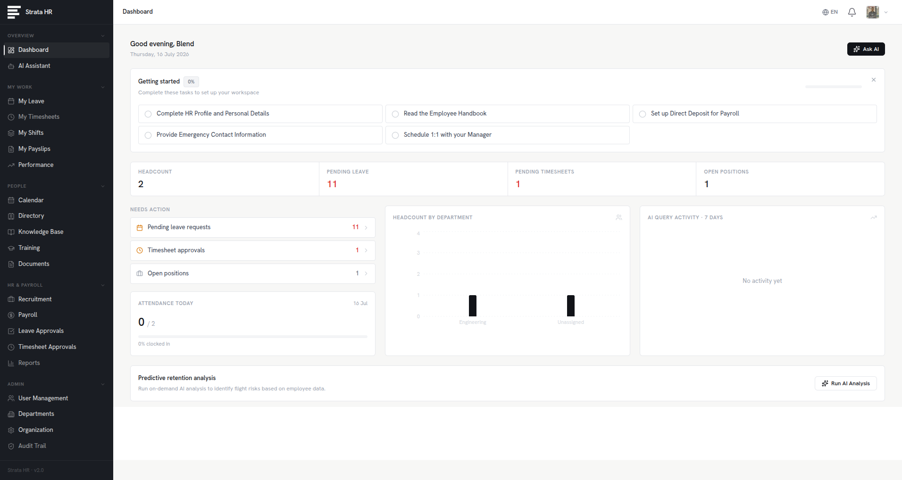

<p align="center">
  
  
  
  
  
  
</p>

<h1 align="center">Strata HR</h1>
<p align="center">
  <strong>Human Resources. Engineered.</strong><br/>
  An instrument-grade, multi-tenant organizational management platform. Features an integrated AI Copilot capable of autonomous data querying, leave approval, shift scheduling, and policy enforcement via natural language.
</p>

<p align="center">
  
</p>

<p align="center">
  <a href="https://strata-hr-final.vercel.app/"><strong>View Live System →</strong></a>
</p>

---


## Features

### AI Copilot
- **Natural-Language Assistant** — Powered by OpenAI GPT-4o.
- **Autonomous Execution** — Executes structural actions: approve leave, query attendance, audit overtime, generate shifts.
- **Context-Aware Constraints** — Enforces strict Role-Based Access Control (RBAC) boundaries during all operations.
- **Persistent Audit Logs** — Conversation history and action traces maintained systematically.

### Core Architecture
- **Directory** — Searchable, filterable organizational structure overview.
- **Department Framework** — Strict hierarchy creation and manager assignments.
- **Access Protocol** — Invitation-based provisioning with explicit clearance levels (Employee, HR, Admin).
- **System Configuration** — Centralized controls for corporate branding and operational parameters.

### Time & Attendance
- **Absence Processing** — Submission, tracking, and balance auditing for sick and vacation allowances.
- **Approval Pipeline** — Frictionless authorization workflows for HR and administrators.
- **Timesheet Tracking** — Clock in/out mechanisms with weekly hour aggregations.
- **Timesheet Audits** — Manager review and systemic validation pipeline.

### Compensation
- **Payroll Execution** — Automated net salary calculation (base + bonus − tax deductions).
- **Payslip Generation** — Detailed, printable ledgers with PDF export capabilities.
- **Self-Service Access** — Secure, isolated payslip retrieval for all active personnel.

### Performance & Objectives
- **Evaluations** — Standardized review formats with structured feedback matrices.
- **Generative Assessment** — Auto-generated review drafts based on historical employee metrics.
- **Objective Tracking** — Hierarchical goal setting for individual and departmental alignment.

### Scheduling
- **Shift Matrix** — Create, assign, and distribute operational shifts via visual grid.
- **Corporate Calendar** — Centralized registry for organizational events and mandates.
- **Event Management** — Structured event creation with exact attendee enforcement.

### Knowledge Infrastructure
- **Document Management** — Secure upload, categorization, and distribution of company assets (via Cloudinary).
- **Knowledge Base** — Indexed, searchable repository for corporate policies and operating procedures.

### Talent Acquisition
- **Requisition Management** — Creation and lifecycle tracking of open positions.
- **Applicant Tracking** — Pipeline visualization for candidate evaluation.
- **External Portal** — Dedicated, branded interface for external applicant submissions.

### Analytics & Reporting
- **Telemetry** — Real-time metrics on headcount, absence rates, AI interactions, and talent pipelines.
- **Departmental Reports** — Exportable, high-density data views across structural units.
- **Data Export** — Standardized CSV generation for external system integration.

### Internationalization
- **Multi-Locale Architecture**: English (EN), Albanian (SQ), German (DE).
- Seamless runtime switching with no operational interruption.

### Notifications
- **Real-Time Alerts** — Systemic notifications for pending approvals, shift assignments, and operational updates.

---

## Architecture

```
Strata-HR/
├── backend/                    # Node.js + Express 5 API
│   ├── config/                 # PostgreSQL configuration
│   ├── controllers/            # Route handlers (20+ controllers)
│   ├── middleware/             # JWT Auth, rate limiting, error handling
│   ├── routes/                 # REST API routes
│   ├── utils/                  # System utilities, email templates
│   ├── scripts/                # Operational scripts
│   ├── db-migrate*.js          # Modular database migrations
│   └── server.js               # Application entry point
│
├── frontend/strata-hr/         # React 19 + Vite 7 SPA
│   ├── src/
│   │   ├── components/
│   │   │   ├── auth/           # Identity verification
│   │   │   ├── layouts/        # Structural navigation
│   │   │   ├── modals/         # Dialog components
│   │   │   ├── chat/           # Copilot interface
│   │   │   ├── dashboard/      # Telemetry displays
│   │   │   ├── notifications/  # Alert systems
│   │   │   └── ui/             # Core UI primitives
│   │   ├── pages/              # Application views (lazy-loaded)
│   │   ├── context/            # Global state context
│   │   ├── services/           # Axios network client
│   │   ├── i18n/               # Localization matrix
│   │   └── index.css           # Instrument-grade design tokens
│   └── vercel.json             # Deployment routing configuration
│
└── screenshots/                # Visual documentation assets
```

---

## Technical Infrastructure

| Layer | Technology |
|-------|-----------|
| **Frontend** | React 19, Vite 7, TailwindCSS 4, Recharts, Lucide Icons |
| **Backend** | Node.js, Express 5, JWT, Helmet, Rate Limiting |
| **Database** | PostgreSQL 16 |
| **Artificial Intelligence** | OpenAI GPT-4o |
| **Asset Storage** | Cloudinary |
| **Communications** | Nodemailer |
| **Localization** | i18next, react-i18next |
| **Deployment** | Vercel (Frontend), Render/Railway (Backend) |

---

## Deployment Instructions

### Prerequisites
- Node.js 18+
- PostgreSQL 14+
- OpenAI API Key

### 1. Repository Initialization
```bash
git clone https://github.com/blendshalaa/Strata-HR.git
cd Strata-HR
```

### 2. Backend Environment
```bash
cd backend
npm install

cp .env.example .env
# Configure DATABASE_URL, JWT_SECRET, OPENAI_API_KEY, etc.

node migrate-all.js
npm run dev
```

### 3. Frontend Environment
```bash
cd frontend/hr-genie-frontend
npm install
npm run dev
```

Application operational at `http://localhost:5173`

---

## Access Matrices

| Feature | Employee | HR | Admin |
|---------|:--------|:--|:-----|
| Dashboard & Profile | Yes | Yes | Yes |
| AI Copilot | Yes | Yes | Yes |
| Submit Leave / Timesheets | Yes | Yes | Yes |
| View Own Payslips | Yes | Yes | Yes |
| Approve Leave & Timesheets | No | Yes | Yes |
| Run Payroll | No | Yes | Yes |
| Manage Recruitment | No | Yes | Yes |
| Performance Reviews | No | Yes | Yes |
| User & Department Management | No | Yes | Yes |
| Organization Settings | No | No | Yes |

---

## Structural Integrity

Strata HR maintains operational precision across all form factors:
- **Responsive Dialogs** — Adaptive rendering based on viewport boundaries.
- **Navigation Controls** — Off-canvas structural menus for restricted viewports.
- **Input Standardization** — Strict font-scaling limits to prevent unauthorized viewport zooming.

---

## License

Protected under a **Proprietary Portfolio License**.

- You **may** inspect the source code.
- You **may not** redistribute, duplicate, or utilize in commercial operations.
- You **may not** claim attribution.

Refer to the LICENSE file for exact parameters.

---

<p align="center">
  Engineered by <a href="https://github.com/blendshalaa"><strong>Blend Shala</strong></a>
</p>
